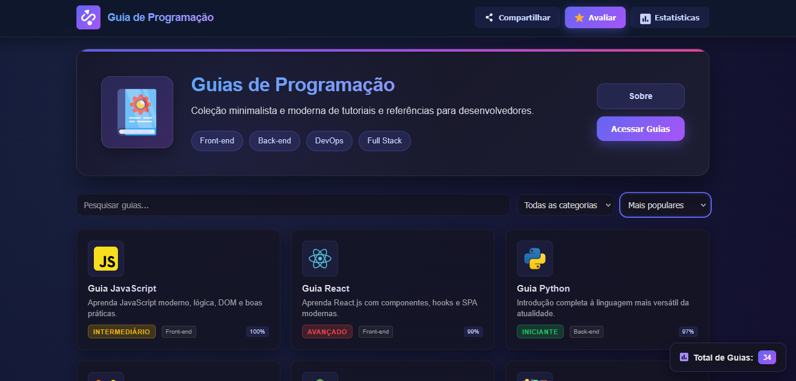

# 🧠 Guia de Programação

---

## 🚀 Sobre o Projeto

O **Guia de Programação** é um repositório dedicado a ajudar programadores de todos os níveis a aprender e dominar diversas linguagens.  
Aqui você encontrará guias **do básico ao avançado**, com explicações, exemplos de código e exercícios práticos.

  

---

## 📚 Linguagens Disponíveis

Atualmente, o repositório contém guias para:

- 🐍 **Python** — Fundamentos, automação e lógica de programação  
- ☕ **Java** — POO e aplicações desktop  
- 🌐 **JavaScript** — Lógica, DOM e projetos interativos  
- 🧱 **HTML & CSS** — Base da web moderna  
- ⚙️ **C** — Fundamentos e lógica estruturada  
- 🦀 **Rust** — Performance e segurança de memória  
- 💙 **Lua** — Guia completo para iniciantes *(Novo!)*  
- 🐦 **Dart** — Fundamentos e integração com Flutter *(Novo!)*  
- 📱 **Flutter** — Criação de apps multiplataforma *(Novo!)*  

---

## 🧾 Logs de Atualizações

> 🔔 **Últimas Atualizações**
> - ✅ Adicionado **Guia Flutter**
> - ✅ Adicionado **Guia Dart**
> - ✅ Adicionado **Guia Lua**

> 🚧 **Em Desenvolvimento**
> - 🧠 Novos guias estão sendo produzidos!
> - 📝 As próximas atualizações serão publicadas aqui nesta seção.

---

## 🤝 Contribuições

Contribuições são **bem-vindas!**  
Sinta-se à vontade para abrir uma **issue** com sugestões ou enviar um **pull request** com melhorias.

> 💬 Toda ajuda é bem-vinda e contribui para o crescimento do projeto.

---

## 📜 Licença

Este projeto é licenciado sob os termos da **Licença MIT**.  
Veja o arquivo [`LICENSE`](LICENSE) para mais informações.

---

## 💻 Autor

**Desenvolvido por [MAEL](https://github.com/maelgamer998)**  
📦 Repositório: [Guia de Programação](https://guiaprogramacao.free.nf)

---

⭐ **Se este projeto te ajudou, não esqueça de deixar uma estrela no repositório!**
